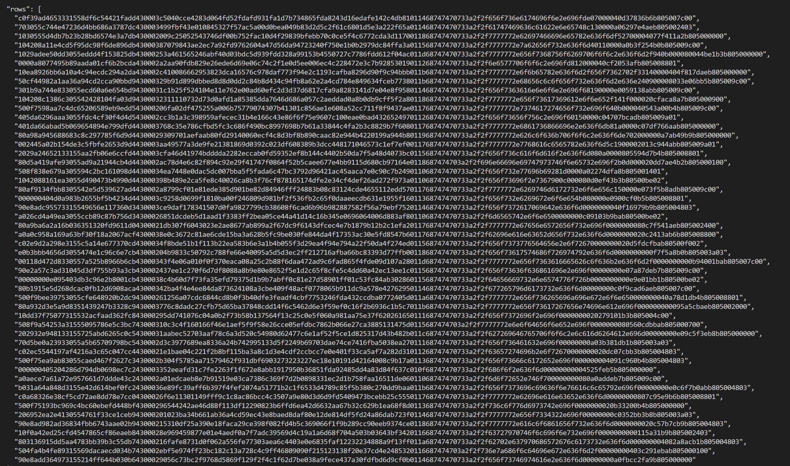

# EOS Producers List

Test task of getting EoS Producers list. For studying purposes only.

List of dependencies:

* sys
* requests
* json

# Build

* Install [Python3](https://www.python.org/downloads/)
* Navigate the terminal to the directory where the script is located using the `$ cd` command.
* Type `python producers_eos.py` or `python3 producers_eos.py` in the terminal to execute the script.

# Parameters

Optional parameters are: limit (first parameter) and lower bound (second parameter). Default values are 100 and 0 respectively.
Example: `python producers_eos.py 100 0` 

# Test results

